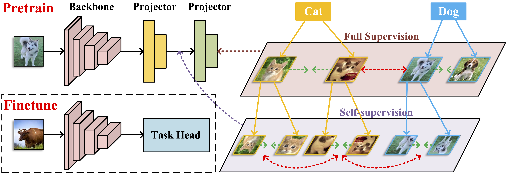

# OPERA: Omni-Supervised Representation Learning with Hierarchical Supervisions

This repository is the official implementation of **"OPERA: Omni-Supervised Representation Learning with Hierarchical Supervisions"**. 




## Updates

Under construction.

- [x] Pretraining code
- [ ] Pretraining details
- [ ] Pretrained models
- [ ] Downstream tasks code

## Results


## Preparation

### Dataset

#### ImageNet

- Download from [here](https://www.image-net.org/)

Organize ImageNet as follows:

```
- dataset
    |- train
    |   |- class1
    |   |   |- image1
    |   |   |- ...
    |   |- ...
    |- test
        |- class1
        |   |- image1
        |   |- ...
        |- ...
```

### Requirements

- Python3
- PyTorch (> 1.0)
- NumPy

### Device 

We conducted most of the experiments with 8 Nvidia RTX 3090 GPU cards. 

## Training Models

### OPERA

To pretrain a ResNet50 on ImageNet-1K for 150 epochs using OPERA on 8 Nvidia RTX 3090 GPU cards, please run the command as follows:
```
python main_moco.py \
  --lr=.3 --epochs=150 -b 1024 \
  --moco-m-cos --crop-min=.2 \
  --dist-url 'tcp://localhost:10001' \
  --multiprocessing-distributed --world-size 1 --rank 0 \
  [your imagenet-folder with train and val folders]
```

To pretrain a DeiT-Small (ViT-Small) on ImageNet-1K for 150 epochs using OPERA on 8 Nvidia RTX 3090 GPU cards, please run the command as follows:
```
python main_moco.py \
  -a vit_small --epochs=150 -b 1024 \
  --optimizer=adamw --lr=1.5e-4 --weight-decay=.1 \
  --epochs=300 --warmup-epochs=40 \
  --stop-grad-conv1 --moco-m-cos --moco-t=.2 \
  --dist-url 'tcp://localhost:10001' \
  --multiprocessing-distributed --world-size 1 --rank 0 \
  [your imagenet-folder with train and val folders]
```

### More options

There are more options to train various models:
| Args | Options |
| - | - |
| -b | 1024 / 2048 / 4096 |
| --epochs |  100/ 150 / 300 |
| --arch | resnet50 / vit_small / vit_base|


## Acknowledgments

Our code is based on MoCo-v3 in (https://github.com/facebookresearch/moco-v3).


## Citation

If you find this project useful in your research, please cite:

````
@article{wang2022opera,
    title={OPERA: Omni-Supervised Representation Learning with Hierarchical Supervisions},
    author={Wang, Chengkun and Zheng, Wenzhao and Zhu, Zheng and Zhou, Jie and Lu, Jiwen},
    year={2022}
}
````
